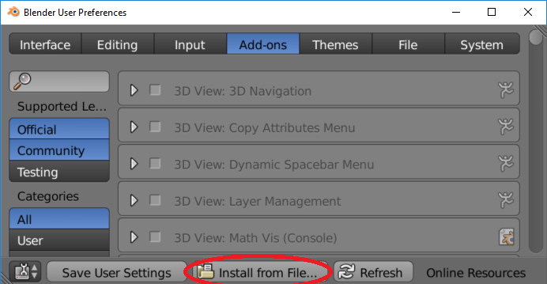
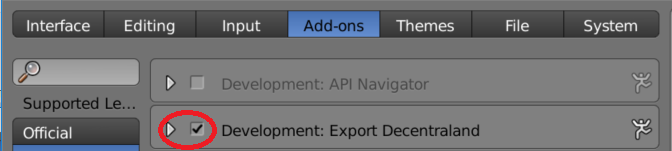
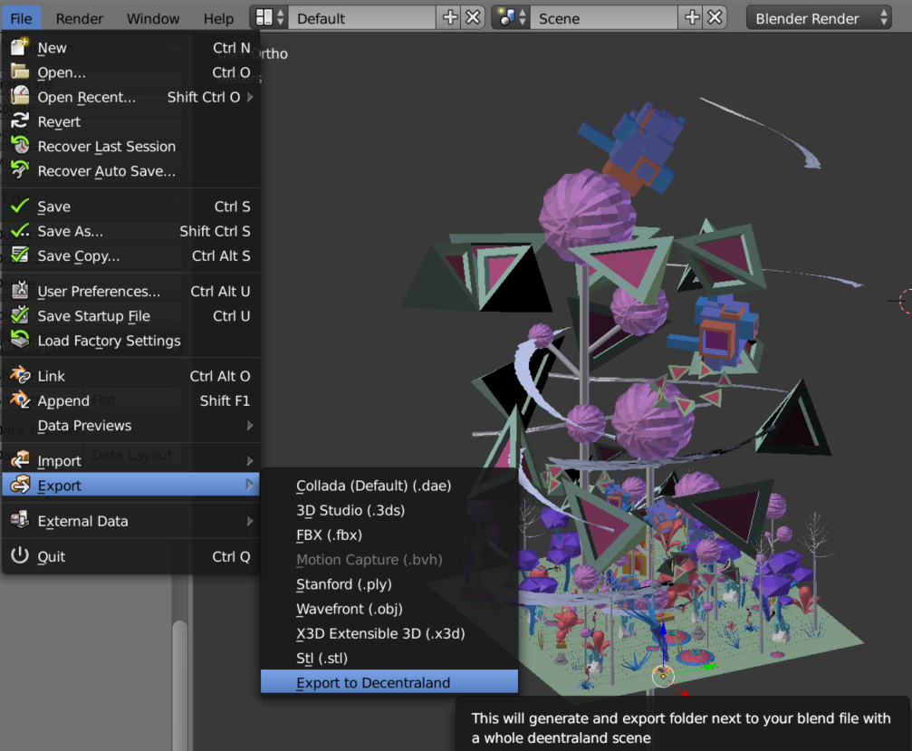

# Blend to Decentraland

A Blender addon to export the current scene to be used in decentraland.

## Install

1. Download [export_to_decentraland.py](//raw.githubusercontent.com/diegodorado/blend2decentraland/master/export_to_decentraland.py).

2. Open Blender, go to User Preferences (Ctrl+Alt+U), click on Add-ons tab, and then click on "Install from file..." and browse the downloaded `export_to_decentraland.py` file.

  


3. Make sure to activate the Add-on.

  

You are ready to go!

## Use

Open a `.blend` file and simply go to `File -> Export -> Export to Decentraland`
( the `.blend` must be saved in advance)



A folder named `export` will be created next to your `.blend` file with the following structure:

```
export/
--scene.xml
--models/
    (all .obj and .mtl involved)
```

Note: non-visible objects wont be exported
